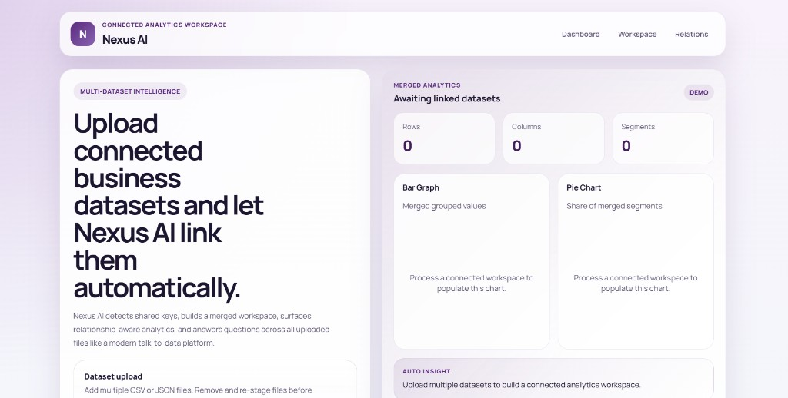
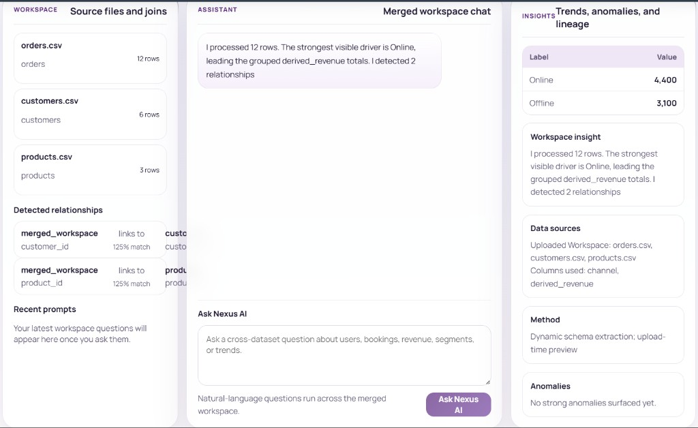
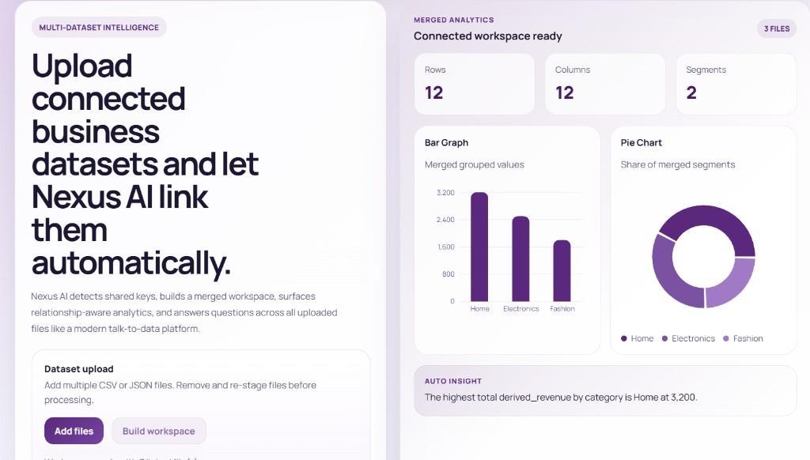
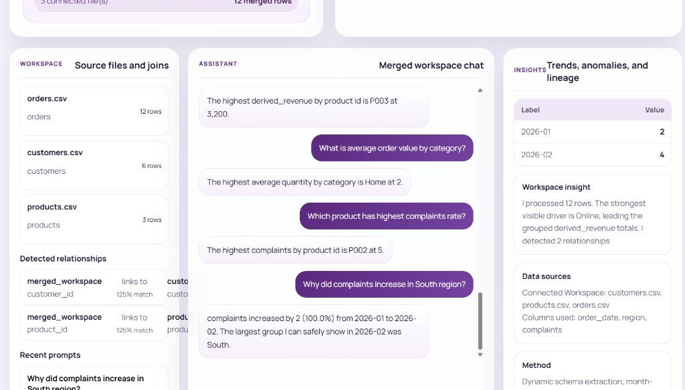
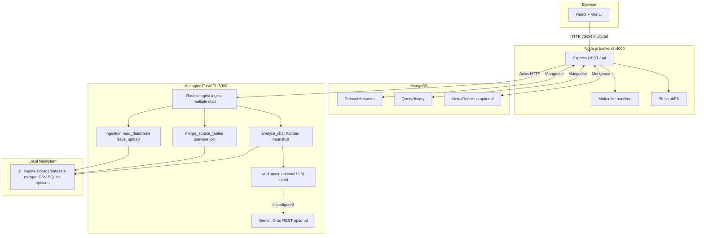
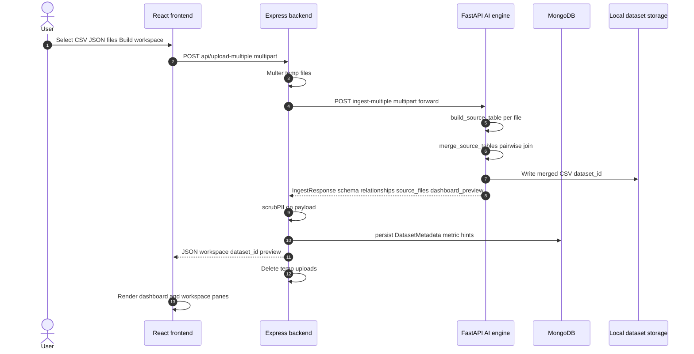
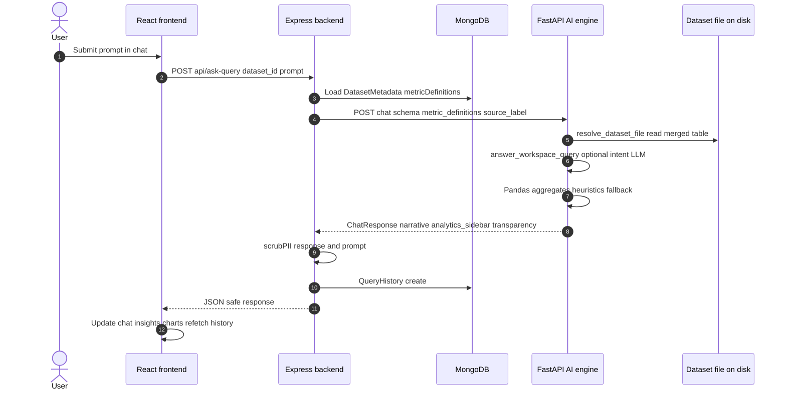
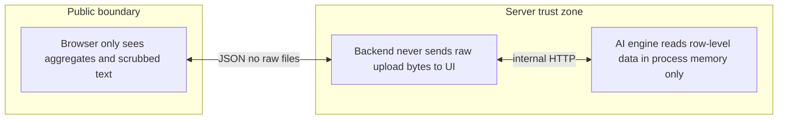

# TEAM - Mission IMPossible
# 🤖 Nexus AI — Connected Analytics Workspace  (Theme: Talk To Data)

**NatWest Group *present* Code for Purpose – India Hackathon** · Self-service “talk to data” prototype

This repository is a full-stack analytics workspace: upload one or more related datasets (CSV / JSON / Excel), merge them on detected keys, ask questions in plain language, and receive **aggregate-only** answers with charts, lineage, and optional query history. It is intended for **business and data analysts**, **hackathon judges**, and **developers** evaluating safe, transparent NL→analytics patterns.

---

## Overview

**What it does.** The app ingests tabular files, stores metadata in MongoDB, forwards analysis to a Python AI engine (FastAPI + Pandas), and serves a React UI with upload, dashboard preview, a three-pane workspace (sources / chat / insights), and recent-query recall.

**Problem it solves.** Teams need quick, **governed** answers across linked files without exposing row-level PII in narratives. The pipeline emphasizes **transparency** (which columns and files were used) and **PII scrubbing** on the API boundary.

**Who it is for.** Demo users and judges running the stack locally; engineers extending ingestion, heuristics, or optional LLM providers (Gemini / Groq) configured via environment variables.

---

## Features (implemented and working)

- **Single-file upload** and **multi-file workspace** with automatic relationship detection and merged dataset persistence.
- **React + Vite** UI: hero upload + merged dashboard (metrics, Recharts bar and pie), **three-column workspace** (workspace pane, assistant chat, insights / analytics pane).
- **Natural-language Q&A** over the merged table: summaries, comparisons, breakdowns, counts, trends (where date columns exist), and schema-style questions.
- **Derived metrics** (e.g. revenue-style heuristics from quantity × price when columns match).
- **MongoDB** persistence for dataset metadata, optional metric definitions, and **query history** (recent prompts + responses).
- **Express API** with PII scrubbing on stored prompts and AI responses.
- **FastAPI AI engine**: CSV / JSON / Excel / SQLite ingestion, `health`, `ingest`, `ingest-multiple`, `chat` endpoints; aggregate-only responses with `analytics_sidebar` and `transparency` objects.
- **Optional LLM** narrative polish and extended workspace flows when `LLM_PROVIDER` and API keys are set (see `ai_engine/.env.example`); **safe fallback** to heuristics when LLM is unavailable or fails.

---

## Tech stack

| Layer | Technologies |
|--------|----------------|
| **Frontend** | React 18, Vite 5, Recharts, CSS (glass-style layout) |
| **Backend** | Node.js, Express, Multer, Axios, MongoDB (Mongoose) |
| **AI engine** | Python 3, FastAPI, Pandas, Pydantic, OpenPyXL (Excel), SQLite read-only |
| **Data** | MongoDB (metadata & history); local file storage under `ai_engine/storage/datasets` |
| **AI / ML (optional)** | Google Gemini or Groq REST APIs for text generation (no training pipeline in repo) |
| **DevOps** | Docker Compose (MongoDB service), Apache-2.0 headers in source |

---

## Repository structure

```
cfp/
├── README.md                 # This file (primary project documentation)
├── docker-compose.yml        # Local MongoDB
├── ai_engine/                # FastAPI service + ingestion & analysis
│   ├── app/
│   ├── requirements.txt
│   └── .env.example
├── backend/                  # Express API + Mongo models
│   ├── src/
│   ├── package.json
│   └── .env.example
├── frontend/                 # React UI
│   ├── src/
│   ├── package.json
│   └── .env.example
├── docs/
│   └── screenshots/          # UI walkthrough PNGs (01.png … 23.png)
└── samples/                  # Example prompts / notes
```
---
## Run On Live Deployment

Use this order every time you test the deployed app:

1. Open the backend health URL:

   ```bash
   https://<your-backend-domain>/health
   ```

   Wait until it returns a JSON response with `status: "ok"`.

2. Open the AI engine health URL:

   ```bash
   https://<your-ai-engine-domain>/health
   ```

   Wait until it returns a JSON response with `status: "ok"`.

3. If either service is still waking up or restarting, wait and refresh until both health checks return `ok`.

4. After both services are healthy, open the deployed frontend URL:

   ```bash
   https://<your-frontend-domain>
   ```

5. Upload sample data and click `Build workspace`.

6. Analyze the data then.

Example with deployed URLs:

```bash
Backend health: https://codeforpurposetest.onrender.com/health
AI health: https://code-for-purpose-ai-2.onrender.com/health
Frontend: https://code-for-purpose-test.vercel.app
```

## If any problem on live server  please ensure to run locally.
---

## Install and run (local)

Prerequisites: **Node.js 18+**, **Python 3.11+**, **Docker** (for MongoDB). Commands below use **Windows PowerShell**; on macOS/Linux use `source .venv/bin/activate` and `cp` instead of `copy`.

### 1. MongoDB

```powershell
docker compose up -d mongo
```

### 2. AI engine (port 8000)

```powershell
cd ai_engine
python -m venv .venv
.\.venv\Scripts\activate
pip install -r requirements.txt
copy .env.example .env
# Edit .env if using optional LLM keys
uvicorn app.main:app --reload --port 8000
```

### 3. Backend API (port 4000)

```powershell
cd backend
npm install
copy .env.example .env
# Set MONGODB_URI, AI_ENGINE_URL, etc.
npm run dev
```

### 4. Frontend (Vite dev server)

```powershell
cd frontend
npm install
copy .env.example .env
# VITE_API_BASE_URL=http://localhost:4000/api
npm run dev
```

Open the URL Vite prints (typically **http://localhost:5173**). Upload datasets, build the workspace, then ask questions from the **Workspace** view.

---

## Configuration and security

- **Do not commit secrets.** Use each package’s **`.env.example`** as a template; copy to `.env` locally.
- Required variables are documented in:
  - `ai_engine/.env.example` — storage path, row limits, optional `GEMINI_*` / `GROQ_*` / `LLM_PROVIDER`
  - `backend/.env.example` — MongoDB URI, AI engine URL, CORS, port
  - `frontend/.env.example` — `VITE_API_BASE_URL`
- Uploaded files are **not** exposed directly to the browser; the backend forwards them to the AI engine and removes temporary copies after processing.

---

## Usage examples

### Typical flow

1. Stage **two or more** CSV/JSON files (e.g. orders + customers + products).
2. Click **Build workspace** and wait for merge + preview.
3. Open **Workspace** (or scroll to the three-pane section) and ask: *“Which region has highest customer activity?”* or *“What is total revenue?”*
4. Inspect **Insights** for chart data, lineage, and method text.

### API shape (chat response)

`POST /api/ask-query` with `{ "dataset_id": "<uuid>", "prompt": "..." }` returns JSON like:

```json
{
  "query_status": "success",
  "insight_narrative": "North has the highest number of unique order id values at 4.",
  "analytics_sidebar": {
    "chart_type": "bar",
    "data_points": [{ "label": "North", "value": 4 }],
    "outliers_noted": []
  },
  "transparency": {
    "data_sources": ["Uploaded Workspace: orders.csv, ...", "Columns used: region, order_id"],
    "metric_definition_used": "Dynamic schema extraction; grouped identifier count"
  }
}
```

### Screenshots

The following captures are from a single demo session (chronological filenames `01.png`–`23.png` in `docs/screenshots/`). See **`docs/screenshots/INDEX.md`** for a full gallery map.


 **App shell / early dashboard state**
 

**Three-pane workspace** — source files, detected joins, recent prompts, chat, and insights.



**Upload + merged dashboard** — metrics, bar chart, pie chart, auto insight after files are linked.



**Extended Q&A** — multiple user questions and assistant answers with updated insight panel.



**Additional frames** (same folder): `01.png`, `02.png`, `04.png`–`14.png`, `16.png`–`21.png`, `23.png`.

---

## System architecture (Mermaid)

Row-level data stays server-side; responses emphasize **aggregates** and **column-level transparency**.

### Component topology

Deployment view: browser, orchestration API, document store, AI service, local file storage, and optional external LLM APIs.



### Sequence: multi-file upload and workspace build



### Sequence: natural-language question (ask-query)



### Data and trust boundaries (simplified)



---

## Technical depth (highlight)

- **Relational merge**: pairwise merge on overlapping column names, favouring `*_id` style keys; merged CSV stored for downstream chat.
- **Heuristic analytics**: intent-style routing (trends, compare, breakdown, counts, schema questions) over typed columns; sensitive column names avoided in narratives where possible.
- **Optional LLMs**: used only for constrained rewrite / understanding when configured; failures fall back to deterministic logic so the demo remains runnable without keys.

---

## Tests

Automated **unit/integration tests** are **not** included in this submission. The hackathon guidelines mark tests as optional; judges can validate behaviour by following the runbook and screenshots above.

---

## Limitations (honest)

- **Not** a production security certification: PII handling is heuristic and layer-scoped; further red-team review would be needed for regulated production use.
- **Join quality** depends on column naming overlap; unusual schemas may merge poorly or require cleaner file preparation.
- **LLM** outputs are optional and bounded by prompts; without API keys, all answers use **rule-based** analytics only.

---

## Future improvements

- Broader join detection (fuzzy column match, user-confirmed keys).
- Automated test suite (`tests/` for Python + API contract tests for Node).
- Stricter RBAC and dataset tenancy for multi-user deployment.

---

## Open source, licensing, and hackathon compliance

- Source files carry **SPDX-License-Identifier: Apache-2.0** style headers where applicable.
- **Dependencies** must respect their respective licences (`package.json`, `requirements.txt`).
- **Developer Certificate of Origin (DCO)** and **single-email** rules apply per hackathon terms; use `git commit -s` when required.
- **No secrets** in git: use `.env.example` only as templates.
- **Repository visibility** and **originality** rules follow the official **26APR0021_02 Hackathon Guidelines and Terms** (NatWest Group *present* Code for Purpose – India Hackathon). Do not misrepresent features in documentation versus the running code.

---

## Compliance (product)

- Uploaded files are not passed raw to the client UI; temporary upload paths on the Node server are deleted after forwarding.
- AI service stores datasets under configurable local storage; SQLite is opened read-only for preview/analysis where applicable.
- API responses are passed through **PII scrubbing** before persistence in query history.

---

## Support

For judging: start **MongoDB**, then **AI engine**, **backend**, **frontend** in that order, confirm `GET http://localhost:8000/health` and `GET http://localhost:4000/health`, then use the UI as shown in **`docs/screenshots/`**.

---

## Collaborators

Nexus AI was built for the **NatWest Group Code for Purpose Hackathon** by:

* **Kunal Purohit** — [GitHub Profile](https://github.com/KunalInTech)
* **Shivam Raj** — [GitHub Profile](https://github.com/ShivamRaj01S)
* **Shambhavi Mishra** — [GitHub Profile](https://github.com/Diya-16204)
* **Yash Singhal** — [GitHub Profile](https://github.com/YashSinghal09)

---
